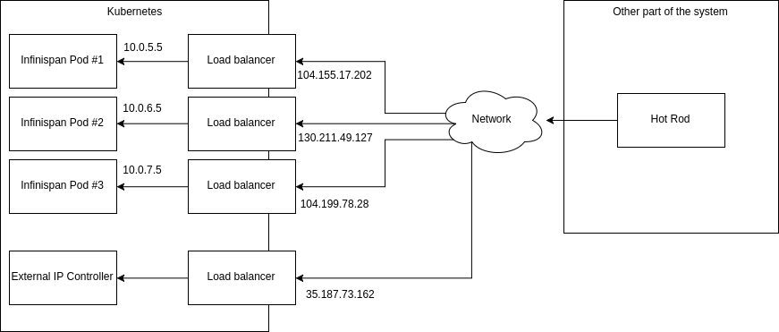

= External IPs for services hosted inside Kubernetes

The main objective of this project is to provide an automated way of exposing services deployed inside https://kubernetes.io/[Kubernetes] into the outside world.

This POC was evaluated using Infinispan cluster.

== POC System diagram

.System diagram

The `External IP Controller` is responsible for creating (and removing if necessary) load balancers on the fly and exposing internal/external address mappings.

== Why we need to map internal and external addresses?

Infinispan L3 client (topology and hash aware) consumes topology information sent by the client to figure out which server holds which key. That's why it is so fast, it always goes to the specific server in a single hop.

Since the server cluster operates using internal addresses, those are used in the topology information sent to the client. Using the diagram above, the client would get `10.0.5.5`, `10.0.6.5` and `10.0.7.5`. Those addresses are not reachable from the outside of the Kubernetes cluster and therefore the client can not use them. That's why they need to be remapped into `104.155.17.202`, `130.211.49.127` and `104.199.78.28`.

The second piece of the puzzle is how to obtain this mapping? Well the `External IP Controller` exposes a YAML file with runtime information on `35.187.73.162:8888` endpoint (see diagram above). The exposed content looks like this:

.Expose IP Controller runtime information
[source,yaml]
----
external-ips:
    namespace: default
    dynamic-ips: true
cluster:
   labels:
      app: infinispan-server
   ports:
      - 11222
untime-configuration:
   service-ip: 35.187.73.162
   external-mapping:
   - 10.0.5.5:104.155.17.202
   - 10.0.6.5:130.211.49.127
   - 10.0.7.5:104.199.78.28
----

A new `AddressMapper` interface was created within https://github.com/infinispan/infinispan/pull/5164[Infiniapn codebase] which allows to map internal address into external ones. For the POC the following implementation has been used:

.Address mapper
[source,java]
----
public class CloudAddressMapper implements AddressMapper {

   private DiscoveryInfo discoveryInfo;

   private Map<String, String> externalToInternalAddressesMapping = new HashMap<>();

   public CloudAddressMapper() {

      try {
         ClusterDiscoveryAgent agent = new ClusterDiscoveryAgent("http://35.187.73.162:8888");
         discoveryInfo = agent.discover();
         System.out.println("discoveryInfo = " + discoveryInfo);
      } catch (IOException e) {
         throw new RuntimeException(e);
      }
   }

   @Override
   public SocketAddress toExternalAddress(SocketAddress internalAddress) {
      InetSocketAddress socketAddress = ((InetSocketAddress) internalAddress);
      String narmalizedAddress = socketAddress.getHostName();
      String externalAddress = discoveryInfo.getExternalAddress(narmalizedAddress);
      if (externalAddress == null) {
         throw new IllegalStateException("No address mapping for " + internalAddress);
      }
      return new InetSocketAddress(externalAddress, socketAddress.getPort());
   }

   @Override
   public SocketAddress toInternalAddress(SocketAddress externalAddress) {
      throw new UnsupportedOperationException("not implemented");
   }
}
----

== How to run it

1. Create an Infinispan cluster in Kubernetes. You might want to use `hack/infinispan.yml`.
2. Run `External IP Controller`: `kubectl create deployment external-ip-proxy --image slaskawi/external-ip-proxy`
3. Monitor Pods and Services to see if all load balancers are up and running
4. Create a `RemoteCacheManager` with `AddressMapper`.

== Benchmark results

You may be wondering what is the performance cost of all this? The answer is not much:

.Benchmark results (done on Google Container Engine)
[width="100%",options="header,footer"]
|========================================================================
| Benchmark name                                     | Time avg |  Error
| Perform 10k puts and gets using internal addresses | 1288.437 | 136.207
| Perform 10k puts and gets using load balancers     | 1461.510 | 64.330
|========================================================================

So the bottom line is - use internal addresses if you can (since they involve only IP Tables) or go with load balancers if you can't.